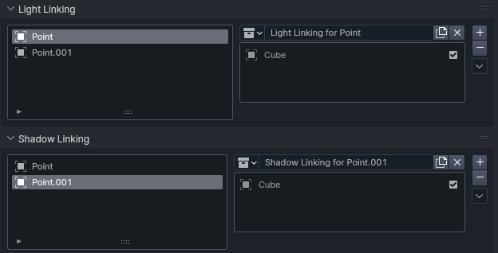
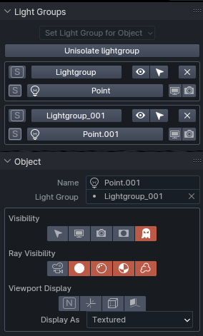

# Estalla
An addon to streamline working with lights in Blender.

[Check out v1.0 announcement](https://www.standingpad.org/posts/2024/01/estalla-first-release/)

# Features
This is a fork of atticus' original lightgroup helper. Here's a summery main features of the addon:
+ Streamline light group creation
    + Set multiple object to one light group with ease
    + Isolate a specific light group or light in a group
+ Management
    + Easy renaming and deletion of light groups
    + Improve visibility options for objects
    + Using light and shadow linking is now 10 times easier with a simple panel

## Light linking
Light linking's UI is pretty clunky at times, requiring selecting the light you want to work with first. Estella makes this easier by bring the light and shadow linking panels to Scene properties, with a UI to make selecting lights easier!

## Light Groups
Estella makes working with light groups less of a chore, by making it both easier to make and view light groups. With Estella, you can hide a group of lights in one click, and isolate to a specific light group in another. Renaming light groups is now made easy with a simply UI, and same with removing.

*Thanks to atticus for the original implementation of light group related features*

Addition improvements are made in this fork:
+ UI adjustments
    + Made UI options easier to use
    + Added documentation for operators and UI elements
    + Fixed grammatical issues in text
+ Code quality improvements
    + Reduced obfuscation in `__init__.py` (see [here](https://github.com/atticus-lv/lightgroup_helper/blob/master/__init__.py) for the original vs [refactored](https://github.com/StandingPadAnimations/lightgroup_helper/blob/master/addon/__init__.py) file)
    + Adjust code to conform to higher code quality standards

# Roadmap
+ Fix combine light groups
+ Add an object centeric UI for light and shadow linking
