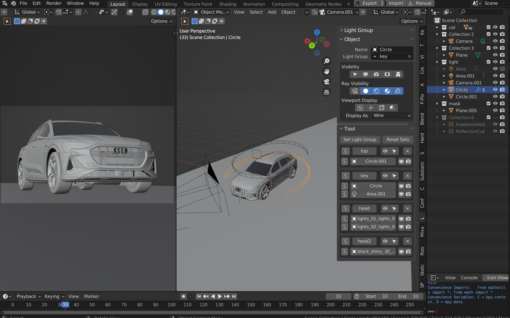

# Estalla

A helper addon for light groups and linking in Blender.

# Features
This is a fork of atticus' original lightgroup helper. Here's the main features of the addon:
+ Streamline light group creation
    + Set multiple object to one light group with ease
    + Isolate a specific light group or light in a group
+ Management
    + Easy renaming and deletion of light groups
    + Improve visibility options for objects
+ Composition 
    + Combine passes in one click!

The following changes are made in this fork:
+ UI adjustments
    + Made UI options easier to use
    + Added documentation for operators and UI elements
    + Fixed grammatical issues in text
+ Code quality improvements
    + Reduced obfuscation in `__init__.py` (see [here](https://github.com/atticus-lv/lightgroup_helper/blob/master/__init__.py) for the original vs [refactored](https://github.com/StandingPadAnimations/lightgroup_helper/blob/master/addon/__init__.py) file)
    + Adjust code to conform to higher code quality standards

